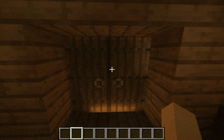
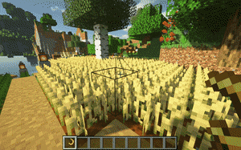

# 😊 更好的Minecraft

## 双开门

双门现在将在您打开其中一侧时自动打开另一侧，因此两扇门同时打开和关闭。 无论玩家是否右键单击它们或涉及红石。

> 

## 更好的农业

右键完全生长的植物即可立即收获并重新种植种子。如果植物具有独特的种子，则不会丢弃种子。

> 

## 查找物品

你有没有想过，你把末影珍珠放在哪里了_，_就像现在一样？别担心，物品查找器已经为您提供了保障。

使用（或任何其他材料）在附近的所有物品中搜索给定的项目 容器和实体清单。（如果你的朋友偷了它就找不到力）**`/finditem minecraft:enderpearl`**

如果您的库存中已有相同类型的物品，您也可以只 按住 **`Shift`** 并在打开的库存中右键单击它以执行对该项目类型的搜索。

> 

## 草径加速

你会在草径上跑得更快

> 

## 镰刀

当你有一大片耕地时,你可以制作镰刀来快速收取一大片的庄稼！金制镰刀是最好的镰刀,当然您也可以通过木材、石头制作镰刀

### 制作方法

> 

### 预览

> 

## 更多
